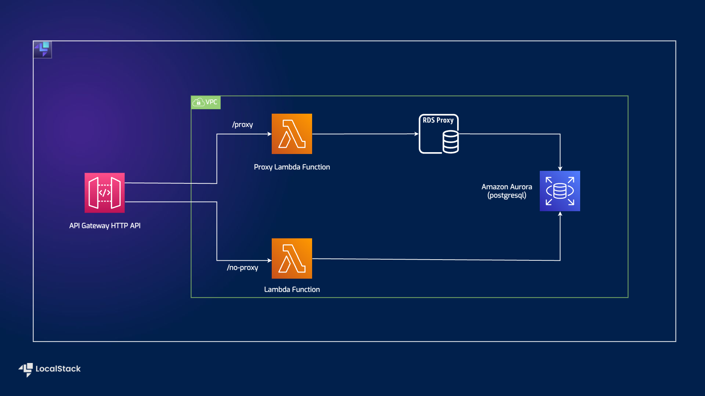

# Serverless RDS Proxy with API Gateway, Lambda, and Aurora

| Key          | Value                                                                |
| ------------ | -------------------------------------------------------------------- |
| Environment  |  |
| Services     | API gateway, RDS Proxy, Lambda, Aurora                                    |
| Integrations | Serverless Framework, SAM, AWS SDK, Cloudformation     |
| Categories   | Serverless, Lambda Functions, Load Testing |
| Level        | Intermediate                                                         |
| Github       | [Repository link](https://github.com/localstack/sample-serverless-rds-proxy-demo) |     

# Introduction

This project demonstrates the advantages of using RDS Proxy in a serverless environment, particularly when working with a relational database like RDS Aurora (PostgreSQL). The goal of this project is to showcase an end-to-end automated setup of RDS Aurora with RDS Proxy, leveraging a basic serverless architecture that includes API Gateway HTTP API and Lambda Functions.

The provided sample sets up two endpoints using the HTTP API — one that directly communicates with the RDS Aurora cluster and another that communicates via the RDS Proxy. Additionally, a load testing setup is implemented to measure the benefits of using RDS Proxy, focusing on its connection pooling and elasticity capabilities.

Before proceeding with this project, please ensure that you already have an operational RDS Aurora PostgreSQL cluster. Also, it's essential to have an RDS Proxy instance set up with forced IAM authentication enabled. If you don't have these components ready, you can [refer to the steps below](#deploy-rds-aurora-cluster-with-rds-proxy) to deploy the RDS Aurora cluster with the RDS Proxy.

## Architecture

The following diagram shows the architecture that this sample application builds and deploys:



We are using the following AWS services to build our infrastructure:

* [Lambda](https://docs.localstack.cloud/user-guide/aws/lambda/) to create the serverless functions for `/proxy` and `/no-proxy`.
* [API Gateway](https://docs.localstack.cloud/user-guide/aws/apigateway/) to expose the Lambda functions to the user through HTTP APIs.
* [RDS](https://docs.localstack.cloud/user-guide/aws/rds/) as the central part of the sample application.
* [Serverless Framework](https://www.serverless.com/) as our Infrastructure as Code framework to deploy the infrastructure on LocalStack.

## Prerequisites

* LocalStack Pro with the [`localstack` CLI](https://docs.localstack.cloud/getting-started/installation/#localstack-cli).
* [Serverless Application Model](https://docs.localstack.cloud/user-guide/integrations/aws-sam/) with the [samlocal](https://github.com/localstack/aws-sam-cli-local) installed.
* [Python 3.9 installed](https://www.python.org/downloads/).
* [Node.js](https://nodejs.org/en/download) with npm package manager.
* [Artillery](https://artillery.io/docs/guides/overview/welcome.html) to generate some load towards both the apis.
* [`yq`](https://github.com/mikefarah/yq#install) and[`jq`](https://jqlang.github.io/jq/download/) for running the deployment script. 

Start LocalStack Pro with the `LOCALSTACK_AUTH_TOKEN` pre-configured:

```shell
export LOCALSTACK_AUTH_TOKEN=<your-auth-token>
localstack start
```

> If you prefer running LocalStack in detached mode, you can add the `-d` flag to the `localstack start` command, and use Docker Desktop to view the logs.

## Instructions

You can build and deploy the sample application on LocalStack by running our `Makefile` commands. Run `make deploy` to create the infrastructure on LocalStack. Run `make stop` to delete the infrastructure by stopping LocalStack.

Alternatively, here are instructions to deploy it manually step-by-step.

### Deploy RDS Aurora Cluster with RDS Proxy

**Note:** If you have already provisioned an RDS Aurora cluster with RDS Proxy, you can skip this step and proceed with [these steps](#deploy-serverless-workload-using-rds-aurora-as-backend) instead.

This stack facilitates the seamless provisioning of an RDS Aurora PostgreSQL database, accompanied by an RDS Proxy to serve as its front-end. The entire setup will be securely deployed within a VPC, utilizing three private subnets. The essential parameters required for the [next step](#deploy-serverless-workload-using-rds-aurora-as-backend) are also provided as stack outputs, ensuring a smooth continuation of the deployment process.

```bash
samlocal build -t rds-with-proxy.yaml --use-container
samlocal deploy -t rds-with-proxy.yaml --guided
```
### Deploy serverless workload using RDS Aurora as backend

To initiate the initial build and deployment of your application, execute the following command in your shell:

```bash
samlocal build --use-container
samlocal deploy --guided
```

### Create a user with `rds_iam` role

To create a user with no password and grant them the `rds_iam` role, use the following command:

```bash
python create-user.py
```

## Load testing

### Checking your installation

If you have installed Artillery globally using `npm`, run the following command in your preferred command-line interface:

```bash
artillery dino
```

Upon execution, an ASCII dinosaur will be printed to the terminal. It should look something like this:


### Testing the application

Before proceeding with load testing, it is essential to update the `target` attribute in the files `load-no-proxy.yml` and `load-proxy.yml` with the HTTP API endpoint you have created. You can find the endpoint as the stack output under `ApiBasePath` after executing the [above steps](#deploy-serverless-workload-using-rds-aurora-as-backend).

Once the target endpoint is appropriately set, you can generate load on both APIs using the following command:

```bash
artillery run load-no-proxy.yml
```

```bash
artillery run load-proxy.yml
``` 

### GitHub Actions

This application sample hosts an example GitHub Action workflow that starts up LocalStack, builds the Lambda functions, and deploys the infrastructure on the runner. You can find the workflow in the `.github/workflows/main.yml` file. To run the workflow, you can fork this repository and push a commit to the `main` branch.

Users can adapt this example workflow to run in their own CI environment. LocalStack supports various CI environments, including GitHub Actions, CircleCI, Jenkins, Travis CI, and more. You can find more information about the CI integration in the [LocalStack documentation](https://docs.localstack.cloud/user-guide/ci/).

## Contributing

We appreciate your interest in contributing to our project and are always looking for new ways to improve the developer experience. We welcome feedback, bug reports, and even feature ideas from the community. Please refer to the [contributing file](https://github.com/localstack/sample-serverless-rds-proxy-demo/blob/main/CONTRIBUTING.md) for more details on how to get started.
